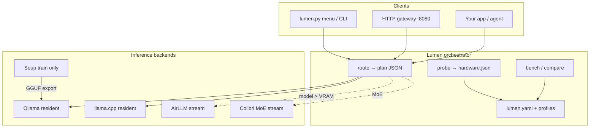
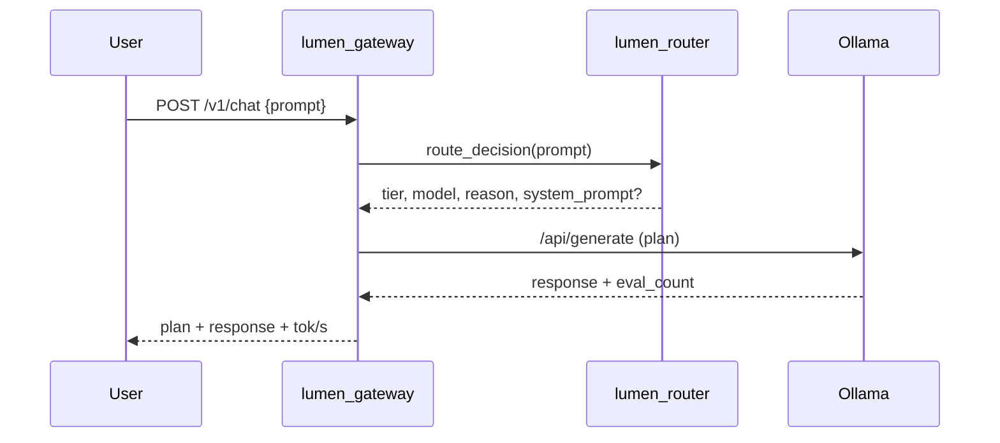
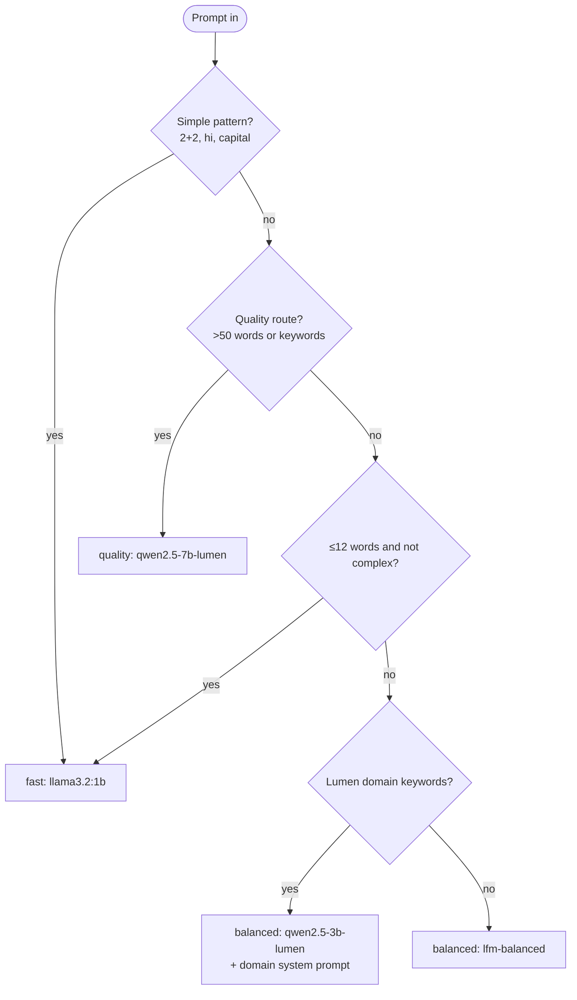
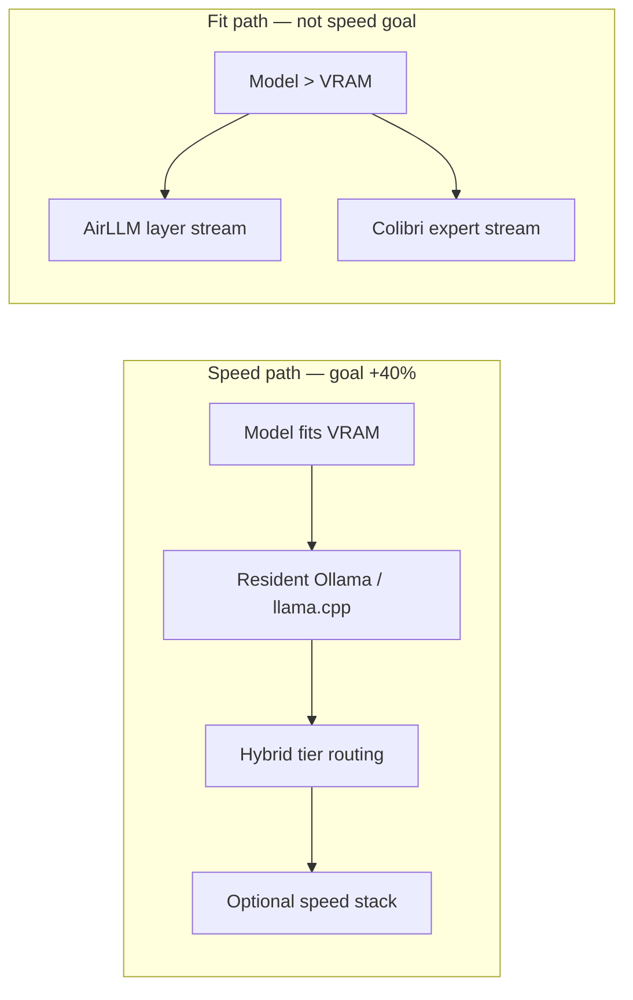
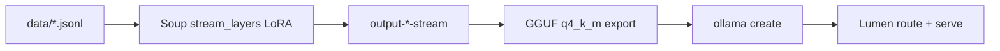
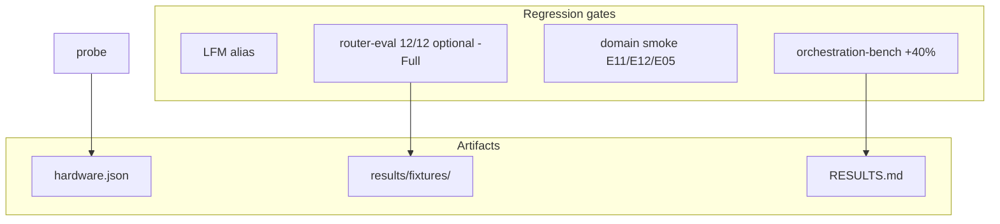
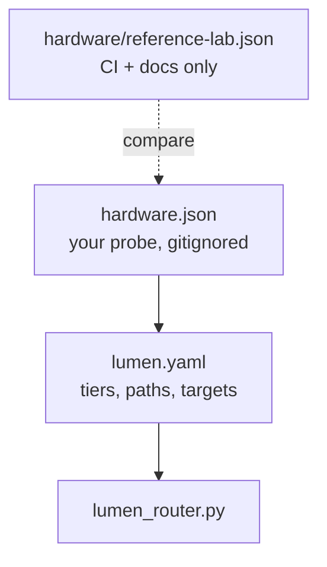

# Architecture (detailed)

This document explains **how Lumen fits together** — routing, backends, training, and measurement. Numbers are from the [reference lab](./REFERENCE-RESULTS.md) unless noted.

---

## 1. Problem statement

Teams run local LLMs but leave throughput on the table because:

1. **One model for every prompt** — short questions pay 3B/7B latency tax.
2. **Wrong tool for the job** — streaming layers when the model already fits VRAM.
3. **No measurement loop** — routing rules are vibes, not benchmarks.

Lumen is a **thin orchestration layer** that picks model tier + backend per request and proves wins with reproducible benches.

---

## 2. High-level system context



---

## 3. Request path (production)



**Dual source of truth for routing rules** (must stay in sync):

| Runtime | File |
|---------|------|
| Python (CLI, gateway, CI) | `lumen_router.py` |
| Windows reference server | `deploy/win-router-lib.ps1` |

---

## 4. Hybrid router decision tree



### Tier summary (reference lab defaults)

| Tier | Model | Typical tok/s (ref. lab) | When |
|------|-------|--------------------------|------|
| `fast` | `llama3.2:1b` | ~95–110 | Short, arithmetic, greetings |
| `balanced` | `lfm-balanced` | ~64–66 | General explain/coding |
| `balanced` (domain) | `qwen2.5-3b-lumen` | ~54–56 | Lumen / Soup / routing keywords |
| `quality` | `qwen2.5-7b-lumen` | ~10–11 | Long prompts, forced quality |

Domain routes inject `data/domain-system-prompt.txt` and targeted prompt prefixes (E11 Laravel, E12 definition, E05 tier routing).

---

## 5. Speed path vs fit path



**Rule:** Do not stream layers for speed when the model already fits. Reference lab proved orchestration (+44%) beats making one 3B kernel faster.

---

## 6. Training → serving pipeline



| Phase | Tool | Reference lab constraint |
|-------|------|--------------------------|
| Train 7B | Soup `stream_layers` | `max_length: 64`, `quantization: none`, 4GB VRAM |
| Train 3B domain | Soup S07 recipe | Same; 184-row dataset |
| Infer 7B | Ollama GGUF | ~10 tok/s — quality tier only |
| Infer hybrid | Lumen router | **~70 tok/s mean** on 12-prompt suite |

Training configs: `soup-7b-stream.yaml`, `soup-3b-stream-s07.yaml`.

---

## 7. Measurement architecture



| Gate | Script | Pass criterion |
|------|--------|----------------|
| Speed | `win-orchestration-bench.ps1` | Mean auto-route ≥ baseline × 1.40 |
| Routing | `win-router-eval.ps1` | 12/12 expected tiers |
| Domain | `win-domain-smoke-gate.ps1` | E11, E12, E05 keyword gates |
| CI (any CPU) | `tests/test_router_parity.py` | Python routing parity |

---

## 8. Backend selection (measured)

Reference lab shootout (`llama3.2:3b`, same GGUF blob):

| Backend | Median decode | Verdict |
|---------|---------------|---------|
| **Ollama** | **~49 tok/s** | Default resident path |
| llama.cpp CLI | ~17 tok/s | Not default on this box |

Contributors on other GPUs should re-run `deploy/win-bench-llamacpp-vs-ollama.ps1` or `scripts/bench_backends.py` — winner may differ.

---

## 9. Configuration layers



See `lumen.yaml.example` for `vram_class`, `routing.tiers`, and `benchmark.target_improvement`.

---

## 10. Repository map

```
lumen-stream-lab/
├── lumen.py / lumen_menu.py     # CLI + interactive UI
├── lumen_router.py              # Routing logic (Python)
├── scripts/lumen_gateway.py     # HTTP reference gateway
├── deploy/win-*.ps1             # Windows reference-lab automation
├── data/router-eval-prompts.json
├── docs/                        # You are here
├── hardware/reference-lab.json
├── results/fixtures/              # Sanitized bench summaries
└── tests/                       # Router parity (CI)
```

---

## 11. What Lumen is not

| Need | Use instead |
|------|-------------|
| Auth, rate limits, audit | Kong, Envoy, API gateway |
| RAG / memory | Vector DB + agent framework |
| Distributed multi-node | vLLM, SGLang, Ray Serve |
| Training UI | Soup directly |
| Kernel rewrite | Ollama / llama.cpp upstream |

Lumen is the **decision layer** above these — see [ENTERPRISE-CASE-STUDY.md](./ENTERPRISE-CASE-STUDY.md) for a full narrative.
