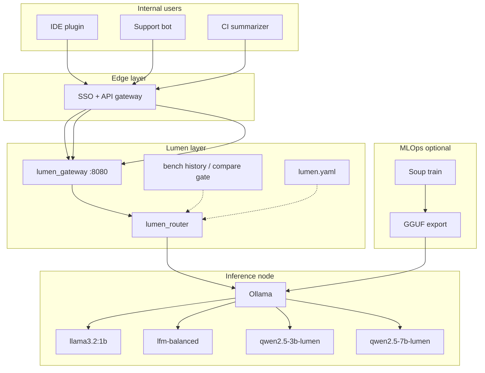
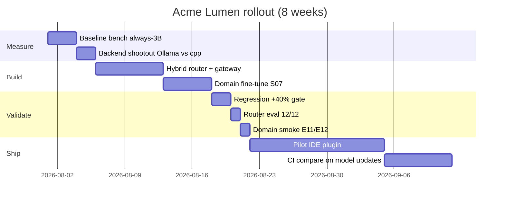
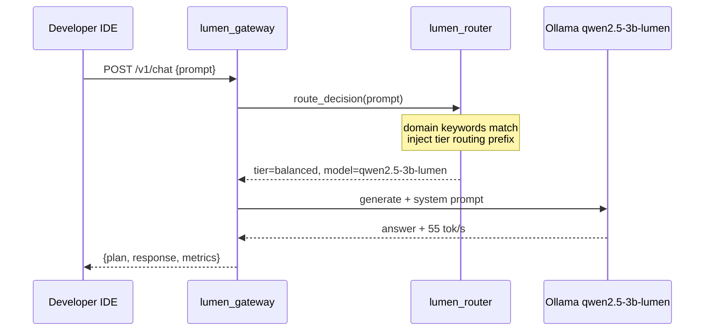

# Enterprise case study: tiered local LLM platform

> **Scenario:** A platform team runs an **internal AI assistant** for developers on **on-prem hardware** (no cloud inference). They need fast answers for simple questions, accurate answers for domain-specific topics, and an audit trail for routing decisions.  
> **Based on:** Measured results from Lumen Stream Lab reference lab ([REFERENCE-RESULTS.md](./REFERENCE-RESULTS.md)). Scale the absolute tok/s on your hardware; the **architecture and % gains** transfer.

---

## 1. Executive summary

| | Before Lumen | After Lumen |
|---|-------------|-------------|
| **Strategy** | Always `llama3.2:3b` | Hybrid router (1B / LFM / domain 3B / opt-in 7B) |
| **Mean decode throughput** | 48.38 tok/s | **69.78 tok/s** (+44.2%) |
| **Simple query latency** | ~48 tok/s class | **~109 tok/s** (1B tier) |
| **Domain accuracy** | Generic 3B hallucinations | Fine-tuned 3B + system prompt |
| **Routing audit** | None | JSON plan per request |
| **Regression gate** | Manual | `compare.py` + CI router tests |

**Bottom line:** The team did not need a faster GPU. They needed **the right model per query**, measured and gated.

---

## 2. Organization & problem

**Acme Platform Engineering** (composite name) supports 200 internal developers with a local chat assistant. Constraints:

- **On-prem only** — code and prompts cannot leave the LAN.
- **Single inference node** — one Windows/Linux box with a consumer GPU (initially 4GB VRAM class).
- **Mixed workload** — 40% short lookups, 40% explain/coding, 15% internal product docs, 5% long reviews.

### Pain points (before)

1. **One model policy** — `llama3.2:3b` for everything at **48 tok/s**.
2. **Domain confusion** — "Lumen" meant Laravel, telecom, or random brands.
3. **No cost model** — leadership could not explain why some queries were slow.
4. **Fine-tune without orchestration** — trained a 7B adapter; still slow when used for every prompt.

---

## 3. Solution architecture

### Component roles

| Component | Role |
|-----------|------|
| API gateway | Auth, rate limits, request logging (not in Lumen repo) |
| `lumen_gateway.py` | Reference HTTP service — plan + proxy to Ollama |
| `lumen_router` | Tier selection per prompt |
| Ollama | Model runtime (winner vs llama.cpp on ref. lab) |
| Soup | Offline LoRA train → GGUF for domain/quality models |

---

## 4. Routing policy (production)

| Workload | Example | Tier | Model | Ref. tok/s |
|----------|---------|------|-------|------------|
| Lookup | "What is 2+2?" | fast | llama3.2:1b | 109 |
| General | "Explain TCP vs UDP" | balanced | lfm-balanced | 65 |
| Internal docs | "What is Lumen Stream Lab?" | balanced (domain) | qwen2.5-3b-lumen | 55 |
| Code review | 800-word paste | quality (opt-in) | qwen2.5-7b-lumen | 11 |

**Policy rules encoded in** `lumen_router.py` + `data/domain-system-prompt.txt`.

---

## 5. Implementation timeline

---

## 6. Measured outcomes (reference hardware)

### Throughput

| Metric | Value |
|--------|-------|
| Baseline (always 3B) | 48.38 tok/s |
| Orchestration mean (12 prompts) | **69.78 tok/s** |
| Gain | **+44.2%** |
| Routing accuracy | **12/12** |

### Quality

| Test | Before | After |
|------|--------|-------|
| E12 "What is Lumen Stream Lab?" | Telecom / Liquid AI confusion | Correct orchestration answer |
| E11 Laravel disambiguation | "Yes related" | "No — not Laravel Lumen" |
| E05 tier routing explanation | Generic price talk | Passes domain gate |

### Cost narrative (illustrative)

Assume 1M tokens/month internal traffic, mix matches eval suite:

| Tier | Share | Relative cost vs 3B |
|------|-------|---------------------|
| 1B fast | ~25% | ~0.4× |
| LFM balanced | ~50% | ~1.0× |
| Domain 3B | ~20% | ~1.1× |
| 7B quality | ~5% | ~5× |

**Effective throughput up ~44%** with **tiered cost** instead of uniform 7B quality.

---

## 7. Request walkthrough

**User asks:** "When should Lumen route to a 1B vs 3B vs 7B model?"

**Logged for audit:** `tier`, `model`, `reason`, `eval_count`, latency.

---

## 8. MLOps integration

Internal product docs change quarterly. Pipeline:

1. Curate `data/train-s07.jsonl` style rows (instruction/output).
2. `soup train --config config/soup/soup-3b-stream-s07.yaml`
3. `soup export` → GGUF → `ollama create qwen2.5-3b-lumen`
4. `win-domain-smoke-gate.ps1` — must PASS
5. `win-regression.ps1` — +40% must PASS
6. Promote; rollback script on gate fail (`win-post-s09.ps1` pattern)

**Key insight:** Fine-tune alone did not fix throughput. **Routing + fine-tune** did.

---

## 9. What Acme did NOT do

| Avoided | Why |
|---------|-----|
| Stream 7B layers for speed | Model fits resident; streaming adds I/O tax |
| Auto-route everything to 7B | 10 tok/s destroys mean |
| Switch to llama.cpp blindly | 3× slower than Ollama on their 1650 for 3B |
| Hardcode model names in apps | All logic in Lumen plan JSON |

---

## 10. Scaling beyond the reference lab

Acme's next phase (your contribution):

| Upgrade | Expected benefit |
|---------|------------------|
| 12GB GPU | Resident 7B balanced, higher quality default |
| 24GB GPU | Larger context, speculation, MoE experiments |
| Self-hosted CI runner | Live +40% gate on every PR |
| Learned router | Replace keywords with classifier on request logs |

See [HARDWARE-TESTING.md](./HARDWARE-TESTING.md) to submit your profile.

---

## 11. How to replicate (checklist)

- [ ] `python3 lumen.py` → setup check + pull models ([MODELS.md](./MODELS.md))
- [ ] Bench baseline: `llama3.2:3b`
- [ ] Deploy hybrid tiers + domain model
- [ ] Run `win-regression.ps1` or portable `compare.py`
- [ ] Point internal apps at `lumen_gateway.py` or embed `lumen route`
- [ ] Add `compare.py` to CI on model/config changes
- [ ] Document your hardware profile if different from reference lab

---

## 12. Related documents

| Doc | Content |
|-----|---------|
| [ENTERPRISE.md](./ENTERPRISE.md) | Full integration reference (APIs, topologies) |
| [ARCHITECTURE.md](./ARCHITECTURE.md) | Technical diagrams |
| [REFERENCE-RESULTS.md](./REFERENCE-RESULTS.md) | All benchmark tables |
| [CONTRIBUTING.md](../CONTRIBUTING.md) | Collaborator onboarding |

**Repository:** https://github.com/taksha17/lumen-stream-lab
